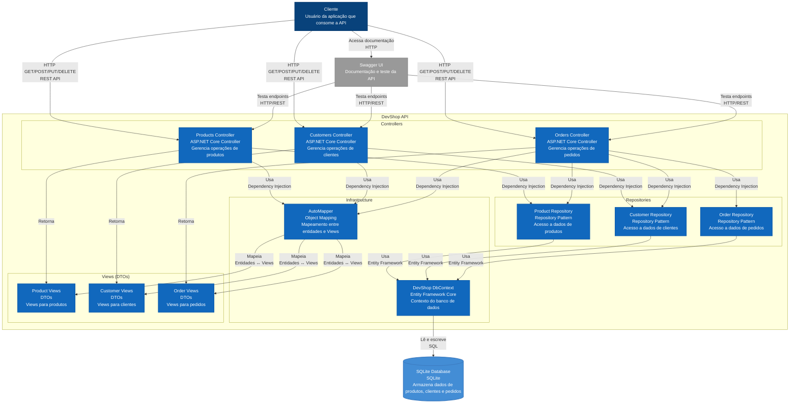

# Diagrama C4 Component - DevShop API

## Visão dos Componentes (C4 Model Level 2)

## Descrição dos Componentes

### Controllers
Responsáveis por receber requisições HTTP e coordenar as operações:

#### Products Controller
- **Responsabilidade**: Gerencia operações de produtos
- **Endpoints**:
  - `GET /api/products` - Lista todos os produtos
  - `GET /api/products/{id}` - Obtém produto por ID
  - `GET /api/products/code/{code}` - Obtém produto por código
  - `GET /api/products/name/{name}` - Obtém produto por nome
  - `GET /api/products/price-range` - Produtos por faixa de preço
  - `GET /api/products/low-stock` - Produtos com estoque baixo
  - `POST /api/products` - Cria novo produto
  - `PUT /api/products/{id}` - Atualiza produto
  - `DELETE /api/products/{id}` - Remove produto

#### Customers Controller
- **Responsabilidade**: Gerencia operações de clientes
- **Endpoints**:
  - `GET /api/customers` - Lista todos os clientes
  - `GET /api/customers/{id}` - Obtém cliente por ID
  - `POST /api/customers` - Cria novo cliente
  - `PUT /api/customers/{id}` - Atualiza cliente
  - `DELETE /api/customers/{id}` - Remove cliente

#### Orders Controller
- **Responsabilidade**: Gerencia operações de pedidos
- **Endpoints**:
  - `GET /api/orders` - Lista todos os pedidos
  - `GET /api/orders/{id}` - Obtém pedido por ID
  - `GET /api/orders/customer/{customerId}` - Pedidos por cliente
  - `GET /api/orders/status/{status}` - Pedidos por status
  - `POST /api/orders` - Cria novo pedido
  - `PUT /api/orders/{id}` - Atualiza pedido
  - `DELETE /api/orders/{id}` - Remove pedido

### Repositories
Implementam o padrão Repository para abstrair o acesso a dados:

#### Product Repository
- **Responsabilidade**: Acesso a dados de produtos
- **Métodos específicos**:
  - `GetByCodeAsync()` - Busca por código único
  - `GetByNameAsync()` - Busca por nome
  - `GetByPriceRangeAsync()` - Produtos por faixa de preço
  - `GetLowStockAsync()` - Produtos com estoque baixo

#### Customer Repository
- **Responsabilidade**: Acesso a dados de clientes
- **Métodos específicos**:
  - `GetWithOrdersAsync()` - Cliente com pedidos incluídos
  - `GetByPhoneNumberAsync()` - Clientes por telefone
  - `GetByAddressAsync()` - Clientes por endereço

#### Order Repository
- **Responsabilidade**: Acesso a dados de pedidos
- **Métodos específicos**:
  - `GetWithDetailsAsync()` - Pedido com detalhes completos
  - `GetAllWithDetailsAsync()` - Todos os pedidos com detalhes
  - `GetByCustomerIdAsync()` - Pedidos por cliente
  - `GetByStatusAsync()` - Pedidos por status
  - `GetByDateRangeAsync()` - Pedidos por período

### Infrastructure

#### DevShop DbContext
- **Responsabilidade**: Contexto do Entity Framework
- **Funcionalidades**:
  - Configuração de entidades
  - Relacionamentos
  - Migrações
  - Atualização automática de timestamps

#### AutoMapper
- **Responsabilidade**: Mapeamento entre entidades e Views
- **Funcionalidades**:
  - Conversão automática
  - Configurações centralizadas
  - Mapeamentos customizados

### Views (DTOs)
Objetos de transferência de dados para separar a camada de apresentação:

#### Product Views
- `ProductView` - Para retorno de dados
- `CreateProductView` - Para criação
- `UpdateProductView` - Para atualização

#### Customer Views
- `CustomerView` - Para retorno de dados
- `CreateCustomerView` - Para criação
- `UpdateCustomerView` - Para atualização

#### Order Views
- `OrderView` - Para retorno de dados
- `CreateOrderView` - Para criação
- `UpdateOrderView` - Para atualização
- `OrderItemView` - Para itens de pedido

## Fluxo de Dados

### Requisição Típica
1. **Cliente** envia requisição HTTP para **Controller**
2. **Controller** valida dados e chama **Repository**
3. **Repository** usa **DbContext** para acessar **Database**
4. **Database** retorna dados para **Repository**
5. **Repository** retorna entidades para **Controller**
6. **Controller** usa **AutoMapper** para converter entidades em **Views**
7. **Controller** retorna **Views** para **Cliente**

### Benefícios da Arquitetura
- **Separação de Responsabilidades**: Cada componente tem uma responsabilidade específica
- **Testabilidade**: Fácil criação de mocks para testes unitários
- **Manutenibilidade**: Código organizado e bem estruturado
- **Escalabilidade**: Fácil adição de novos recursos
- **Flexibilidade**: Troca fácil de implementações via Dependency Injection 