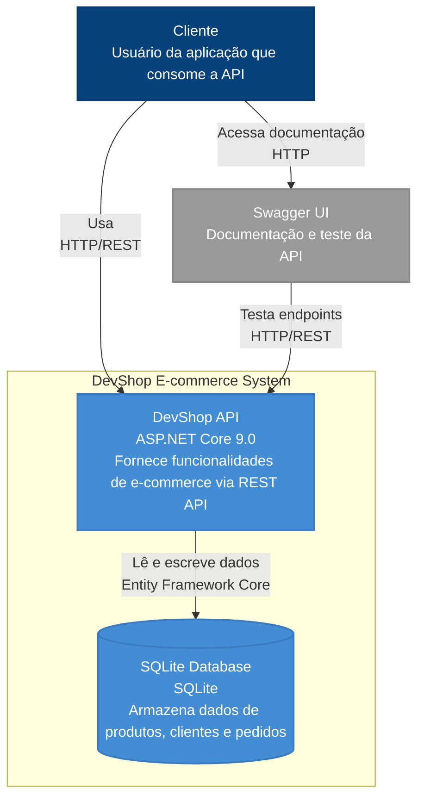

# Diagrama C4 Container - DevShop API

## Visão Geral do Sistema (C4 Model Level 1)

## Descrição dos Containers

### DevShop API
- **Tecnologia**: ASP.NET Core 9.0
- **Responsabilidade**: Fornece funcionalidades de e-commerce via REST API
- **Funcionalidades**:
  - Gerenciamento de produtos (CRUD)
  - Gerenciamento de clientes (CRUD)
  - Gerenciamento de pedidos (CRUD)
  - Consultas avançadas por filtros
  - Validação de dados
  - Mapeamento entre entidades e DTOs

### SQLite Database
- **Tecnologia**: SQLite
- **Responsabilidade**: Armazena dados de produtos, clientes e pedidos
- **Tabelas**:
  - Customers (clientes)
  - Products (produtos)
  - Orders (pedidos)
  - OrderItems (itens de pedido)
- **Características**:
  - Banco de dados local
  - Transações ACID
  - Relacionamentos configurados via Entity Framework

## Relacionamentos

### Cliente → DevShop API
- **Protocolo**: HTTP/REST
- **Descrição**: O cliente consome a API para realizar operações de e-commerce
- **Métodos**: GET, POST, PUT, DELETE

### DevShop API → SQLite Database
- **Protocolo**: Entity Framework Core
- **Descrição**: A API lê e escreve dados no banco SQLite
- **Operações**: CRUD, consultas, transações

### Cliente → Swagger UI
- **Protocolo**: HTTP
- **Descrição**: O cliente acessa a documentação interativa da API
- **Funcionalidade**: Teste de endpoints, visualização de schemas

### Swagger UI → DevShop API
- **Protocolo**: HTTP/REST
- **Descrição**: O Swagger UI testa os endpoints da API
- **Funcionalidade**: Execução de requisições de exemplo

## Benefícios da Arquitetura

### Simplicidade
- Arquitetura monolítica simples
- Fácil de entender e manter
- Rápido para desenvolvimento e deploy

### Escalabilidade
- Pode ser containerizada facilmente
- Suporte a múltiplas instâncias
- Banco de dados pode ser migrado para SQL Server/PostgreSQL

### Testabilidade
- Separação clara de responsabilidades
- Padrão Repository facilita testes unitários
- Swagger UI para testes de integração

### Manutenibilidade
- Código bem estruturado
- Padrões estabelecidos (Repository, DTOs, AutoMapper)
- Documentação automática via Swagger 